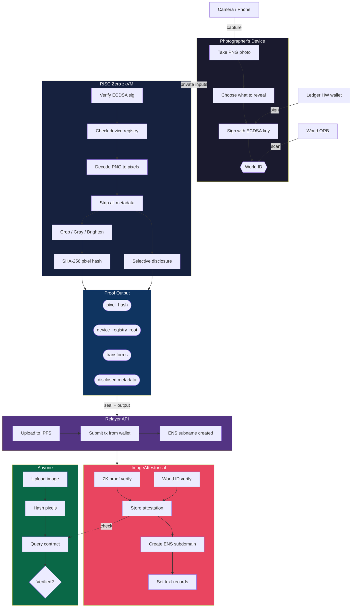

# ProofFrame

> **Prove your photo is real — not AI — without revealing who you are.**

AI-generated images are flooding the internet. Anyone can fabricate a photo of a war zone, a protest, or a politician — and there's no reliable way to tell real from fake. This is the misinformation crisis: when every image is suspect, truth loses its power.

ProofFrame fights back. It's a zero-knowledge content authenticity system that cryptographically proves an image **came from a real camera, not an AI model** — while keeping the photographer anonymous. Built with RISC Zero zkVM for [ETHGlobal Cannes 2026](https://ethglobal.com/events/cannes2026).

### Why existing solutions fail

C2PA camera signatures prove photos haven't been altered — but they reveal the photographer's GPS, camera serial number, and identity. Nobody will adopt a system that turns every photo into a surveillance record. Journalists, whistleblowers, and war correspondents need privacy.

### How ProofFrame solves both problems

1. **Proves the image is NOT AI-generated** — a real camera's secure element signs the image at capture. The ZK proof verifies this hardware signature against a device registry of known manufacturers. No AI model can forge a valid camera signature.
2. **Proves edits are legitimate** — crop, adjust brightness, convert to grayscale. The ZK proof guarantees these are the only changes made. No deepfakes, no pixel manipulation, no splicing.
3. **Preserves photographer privacy** — all metadata (GPS, timestamps, device serial) is selectively disclosed or stripped entirely. The photographer's wallet never appears on-chain.

*Privacy enables adoption, adoption fights fakes.*

---

## How It Works

1. **Photographer uploads a photo** with all its metadata (GPS, date, camera info)
2. A **camera signing key** creates an ECDSA signature over the file — this key is checked against a Merkle tree of authorized device keys (mock C2PA for hackathon; production uses real camera manufacturer keys)
3. **Inside RISC Zero's zkVM**, the guest program:
   - Verifies the ECDSA signature is valid *(private — never leaves the VM)*
   - Checks the signing key belongs to the authorized device registry *(private — only the Merkle root is revealed)*
   - Decodes the PNG to raw pixels — **all metadata is discarded** because the `image` crate only outputs a pixel buffer, structurally stripping EXIF, XMP, IPTC, C2PA, and ICC data
   - Applies any transforms the photographer requested (crop, grayscale, brightness)
   - Hashes the final pixels with hardware-accelerated SHA-256
   - Selectively reveals only the metadata fields the photographer chose
4. **World ID** verifies the photographer is a unique human (anti-Sybil, per-image nullifier)
5. **Image uploaded to IPFS** — clean PNG pinned via Infura, CID available before on-chain submission
6. **A relayer submits the proof on-chain** from a shared wallet — the photographer's address never appears on the blockchain
7. **ENS subdomain created atomically** — `{pixelHash}.proof-frame.eth` with text records (pixelHash, fileHash, IPFS CID, transforms, metadata) set on-chain via NameWrapper + Public Resolver
8. **Anyone can verify:** decode any image to pixels, hash them, check if that hash has an on-chain attestation

**What the verifier sees:**
> "This image's pixels hash to `0x7f3a...`. An authorized device signed it. It was cropped and converted to grayscale. The photo was taken on April 4, 2026 in Cannes, France. IPFS: QmXyz..."

**What the verifier does NOT see:**
> Which device, which camera, exact GPS, serial number, photographer name, wallet address, editing history, or any metadata the photographer chose to hide.

---

## Why It Can't Be AI

AI image generators (Midjourney, DALL-E, Stable Diffusion) produce photorealistic images, but they **cannot forge a hardware camera signature**. ProofFrame's trust chain:

1. **Hardware anchor** — the signing key lives in a camera's secure element (TPM/SE). No software can extract it.
2. **Signature verification in ZK** — the guest program verifies the ECDSA signature inside the zkVM. The proof guarantees "a key from the authorized device registry signed this exact file."
3. **Device registry** — a Merkle tree of known camera manufacturer public keys. Only real devices are in the tree.
4. **Pixel-level integrity** — the proof covers the exact pixel content. Any modification (even a single pixel) produces a different hash.

An AI model would need to compromise a camera's hardware secure element to produce a valid signature. This is the same trust model as C2PA — but with privacy.

---

## Architecture



> **Privacy guarantee**: the signing key, full EXIF, and raw image never leave the zkVM. The relayer's wallet appears on-chain — not the photographer's. The contract stores only the pixel hash and IPFS CID. No identity at any layer.

---

## Privacy Model

The photographer's identity is hidden at **every layer**:

| Layer | How privacy is achieved |
|-------|------------------------|
| **Blockchain tx** | Relayer submits from shared wallet. `msg.sender` = relayer, NOT photographer |
| **ZK proof** | Signing key is a private input. Proof reveals only "some key in this device registry" |
| **World ID** | Nullifier hash is per-image and unlinkable. Proves "a unique human" not "which human" |
| **Image file** | Published PNG re-encoded from pixels. Zero metadata survives decode |
| **ENS subnames** | Created on-chain by contract via NameWrapper. No photographer wallet involved |
| **Network** | Photographer only talks to relayer API. Can use Tor/VPN |

### Selective Disclosure

The photographer chooses per-image what to reveal:

| Scenario | Date | Location | Camera | Dimensions |
|----------|------|----------|--------|------------|
| War correspondent | Yes | City only | No | Yes |
| Insurance claim | Yes | Exact GPS | Yes | Yes |
| Whistleblower | No | No | No | No |
| News agency | Yes | Exact GPS | Yes | Yes |

Disclosed fields are **verified by the ZK proof** — they came from the signed file and cannot be forged without breaking the ECDSA signature.

---

## Trust Model

| What signs | What it proves | Status |
|-----------|----------------|--------|
| Mock software key (secp256k1) | "A registered signer committed to this image" | Hackathon demo |
| Ledger hardware key | "A hardware device approved this" — key theft resistance | Roadmap |
| Camera factory key (Leica/Sony/Nikon) | "An authorized camera captured this" — true provenance, NOT AI | Roadmap |

The same ZK pipeline works at all three levels. Only the signing key changes. AI cannot forge any of these signatures.

---

## What Metadata Gets Stripped

A single PNG from a modern camera contains dozens of identifying data points. ProofFrame strips all of them by decoding to raw pixels inside the ZK VM:

| Metadata | What it contains | Risk |
|----------|------------------|------|
| **EXIF** | GPS (sub-meter), camera serial, lens serial, timestamp, face data, uncropped thumbnail | Critical |
| **XMP** | Creator name, editing history, software paths, persistent document ID | Critical |
| **IPTC** | Byline, credit, contact info (address, phone, email) | Critical |
| **C2PA** | Full X.509 certificate chain identifying photographer/org, complete provenance | Critical |
| **ICC** | Color profile with device manufacturer/model signatures | Moderate |
| **PNG chunks** | tEXt/iTXt (AI generation parameters, XMP), eXIf, iCCP | Moderate |

---

## Verified Edits

Photographers can edit their images — but only with provably correct transforms:

| Transform | Cycle cost (640x480) | Notes |
|-----------|---------------------|-------|
| **Crop** | ~700K | Cheapest — pixel copying |
| **Grayscale** | ~1.5M | Integer weighted sum |
| **Brightness** | ~3-5M | Clamped addition |
| **Chain** | Sum of above | Apply multiple in sequence |

The proof covers the entire transform chain: *"An authorized device signed an original file. When decoded and transformed with crop(10,10,300,220)+grayscale, the resulting pixels hash to X."* No other changes are possible — mathematically proven.

---

## Quick Start

```bash
# 1. Install RISC Zero
curl -L https://risczero.com/install | bash
rzup install

# 2. Generate test images
python3 scripts/generate-test-images.py

# 3. Dev mode proof generation
RISC0_DEV_MODE=1 cargo run -p proofframe-host --release -- --image test_images/ethglobal_cannes.png

# 4. Deploy contracts
cd contracts
forge script script/Deploy.s.sol --tc Deploy --rpc-url $SEPOLIA_RPC_URL --broadcast

# 5. Run frontend
cd frontend && bun install && bun run dev
```

**Live demo:** [proofframe.fly.dev](https://proofframe.fly.dev)

---

## Sponsor Integrations

### Ledger — Hardware Trust ($10K pool)

EIP-712 typed data signing for `attestImage()` displays human-readable attestation fields on the Ledger screen via Clear Signing. ERC-7730 descriptor included (`calldata-ImageAttestor.json`). Positions Ledger as a **content authenticity device** — every photographer becomes a potential Ledger customer. Wallet connection is optional — attestation works without it via anonymous relay.

### ENS — Discovery Layer ($10K pool)

On-chain subdomains via NameWrapper: `{pixelHash}.proof-frame.eth` created atomically inside `attestImage()`. Text records set on-chain via Public Resolver: `url`, `avatar`, `contenthash`, `io.proofframe.pixelHash`, `fileHash`, `merkleRoot`, `ipfsCid`, `transforms`, `dimensions`, and disclosed metadata. The bounty asks for *"store ZK proofs in text records"* — this delivers exactly that, fully on-chain.

### World ID — Anti-Sybil ($20K pool)

`signal = hashToField(pixelHash)` binds human verification to specific image content. Per-image nullifier scoping: `externalNullifier = hash(appId, "attest_" + pixelHash)` — same human can attest different images but cannot attest the same image twice. Relayer-compatible — World ID's `verifyProof` does not check `msg.sender`.

---

## Contract Addresses (Sepolia)

| Contract | Address |
|----------|---------|
| **ImageAttestor** (current) | `0x7Ec0Bc3Af8927dB9D31Bb23F28aE3c642C23Ed6f` |
| RISC Zero Verifier Router | `0x925d8331ddc0a1F0d96E68CF073DFE1d92b69187` |
| World ID Router | `0x469449f251692e0779667583026b5a1e99512157` |
| ENS NameWrapper | `0x0635513f179D50A207757E05759CbD106d7dFcE8` |
| ENS Public Resolver | `0xE99638b40E4Fff0129D56f03b55b6bbC4BBE49b5` |

---

## Performance

| Metric | Value |
|--------|-------|
| Guest cycles (640x480 PNG + crop + grayscale) | ~15-55M |
| Proving time (RTX 4090) | ~30-90 seconds |
| Proving time (dev mode) | ~2 seconds |
| On-chain verification gas | ~300-640K |
| Groth16 proof size | ~192 bytes |

---

## Key Technical Decisions

| Decision | Choice | Why |
|----------|--------|-----|
| ZK Framework | RISC Zero zkVM v3.0 | Pure Rust, `image` crate works, SHA-256/ECDSA precompiles |
| Signature | Raw ECDSA / SHA-256 | Ethereum `personal_sign` uses Keccak (not accelerated in zkVM) |
| Image format | PNG only | Lossless + integer-only decode (no float-heavy JPEG DCT) |
| Submission | Permissionless relayer | `msg.sender` irrelevant; contract checks only proof validity |
| ENS | On-chain NameWrapper subdomains | Atomic with attestation, text records via Public Resolver |
| World ID | Required, per-image nullifier | Anti-Sybil without identity linkage |
| IPFS | Upload before tx, CID on-chain | Permanent storage, CID in contract + ENS contenthash |

---

## Why Now

AI-generated fakes are eroding trust in all visual media. When every image is suspect, disinformation wins by default. **EU AI Act Article 50** mandates content provenance by **August 2, 2026** — four months from this hackathon. Penalties: up to 35M EUR or 7% of global annual turnover. C2PA provides camera-level signing, but its privacy model is fundamentally broken — nobody will adopt authenticity tools that double as surveillance.

ProofFrame is the missing layer: **proof without surveillance**. Authenticity that fights disinformation without sacrificing privacy. The first system that can say *"this photo came from a real camera, was edited only with these specific transforms, and a real human approved it"* — without revealing which camera, which transforms were chosen from, or which human.

---

## Documentation

| Document | Contents |
|----------|----------|
| [Architecture](docs/ARCHITECTURE.md) | Complete technical reference — every decision, crate version, cycle count, and pitfall |
| [Diagrams](docs/DIAGRAMS.md) | Mermaid architecture diagrams (renders on GitHub) |
| [Tasks](docs/TASKS.md) | Implementation checklist |

---

## License

MIT
