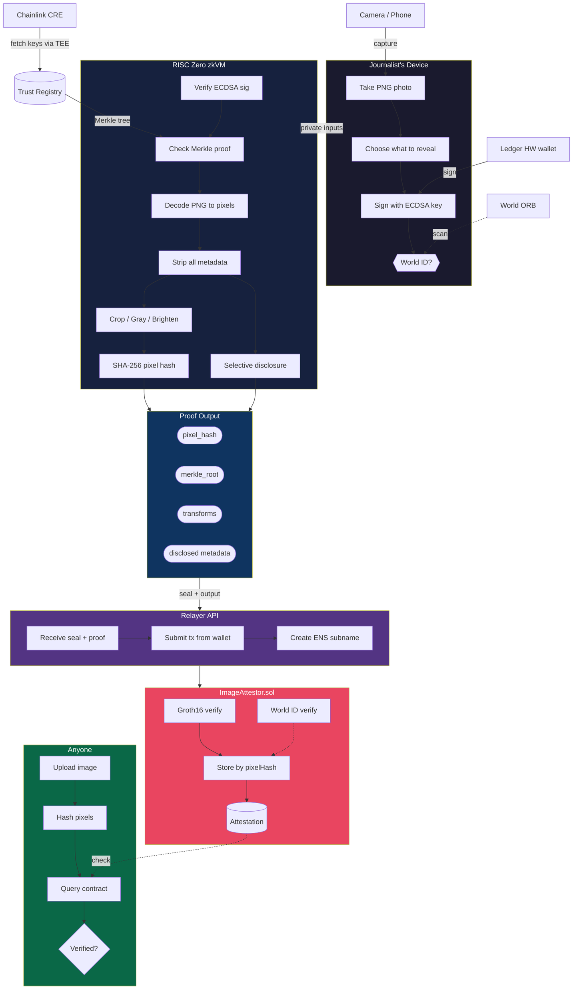

# ProofFrame

> **Prove your photo is real, untampered, and private.**

AI-generated images and deepfakes are flooding the internet. Anyone can fabricate a photo of a war zone, a protest, or a politician — and there's no reliable way to tell real from fake. This is the misinformation crisis: when every image is suspect, truth loses its power.

ProofFrame fights back. It's a zero-knowledge content authenticity system that cryptographically proves an image hasn't been tampered with — while keeping the photographer anonymous. Built with RISC Zero zkVM for [ETHGlobal Cannes 2026](https://ethglobal.com/events/cannes2026).

C2PA camera signatures already prove photos haven't been altered — but they reveal the photographer's GPS, camera serial number, and identity. Journalists in conflict zones, whistleblowers, and activists can't use a system that identifies them. ProofFrame keeps the tamper-proof guarantee while adding privacy: a ZK proof that says *"an authorized device signed this exact image, and it hasn't been modified since"* — without revealing *which device* or *who signed it*.

---

## How It Works

1. **Photographer uploads a photo** with all its metadata (GPS, date, camera info)
2. A signing key creates an ECDSA signature over the file — this key is in a Merkle tree of authorized signers
3. **Inside RISC Zero's zkVM**, the guest program:
   - Verifies the ECDSA signature is valid *(private — never leaves the VM)*
   - Checks the signing key belongs to the authorized set *(private — only the Merkle root is revealed)*
   - Decodes the PNG to raw pixels — **all metadata is discarded** because the `image` crate only outputs a pixel buffer, structurally stripping EXIF, XMP, IPTC, C2PA, and ICC data
   - Applies any transforms the photographer requested (crop, grayscale, brightness)
   - Hashes the final pixels with hardware-accelerated SHA-256
   - Selectively reveals only the metadata fields the photographer chose (e.g. date and city-level location, but not exact GPS or camera serial number)
4. **A relayer submits the proof on-chain** from a shared wallet — the photographer's address never appears on the blockchain
5. **Anyone can verify:** decode any image to pixels, hash them, check if that hash has an on-chain attestation

**What the verifier sees:**
> "This image's pixels hash to `0x7f3a...`. An authorized signer committed to it. It was cropped and converted to grayscale. The photo was taken on April 4, 2026 in Cannes, France."

**What the verifier does NOT see:**
> Which signer, which camera, exact GPS, serial number, photographer name, editing history, or any metadata the photographer chose to hide.

The `image` crate's decode-to-pixels operation is the metadata firewall — it structurally cannot preserve metadata — and the ZK proof guarantees this happened correctly without revealing the private inputs.

---

## Architecture



> **Privacy guarantee**: the signing key, full EXIF, and raw image never leave the zkVM. The relayer's wallet appears on-chain — not the journalist's. The contract stores only the pixel hash. No identity at any layer.

---

## Privacy Model

The journalist's identity is hidden at **every layer**:

| Layer | How privacy is achieved |
|-------|------------------------|
| **Blockchain tx** | Relayer submits from shared wallet. `msg.sender` = relayer, NOT journalist |
| **ZK proof** | Signing key is a private input. Proof reveals only "some key in this Merkle tree" |
| **World ID** | Nullifier hash is unlinkable across images. Proves "a unique human" not "which human" |
| **Image file** | Published PNG re-encoded from pixels. Zero metadata survives decode |
| **ENS subnames** | Created by relayer via NameStone API. No journalist wallet involved |
| **Network** | Journalist only talks to relayer API. Can use Tor/VPN |

### Selective Disclosure

The photographer chooses per-image what to reveal:

| Scenario | Date | Location | Camera | Dimensions |
|----------|------|----------|--------|------------|
| War correspondent | ✅ | City only | ❌ | ✅ |
| Insurance claim | ✅ | Exact GPS | ✅ | ✅ |
| Whistleblower | ❌ | ❌ | ❌ | ❌ |
| News agency | ✅ | Exact GPS | ✅ | ✅ |

Disclosed fields are **verified by the ZK proof** — they came from the signed file and cannot be forged without breaking the ECDSA signature.

---

## Trust Levels

| Level | What signs | What it proves | Status |
|-------|-----------|----------------|--------|
| **1. Hackathon** | Mock software key | "A registered signer committed to this" — reputation model | ✅ Built |
| **2. Production** | Ledger hardware key | "A hardware device approved this" — key theft resistance | Roadmap |
| **3. Full C2PA** | Camera factory key (Leica/Sony/Nikon) | "An authorized camera captured this" — true provenance | Roadmap |

The same ZK pipeline works at all three levels. Only the signing key changes. ProofFrame's contribution is the **privacy layer** that works regardless of trust level.

---

## What Metadata Gets Stripped

A single JPEG/PNG from a modern camera contains dozens of identifying data points. ProofFrame strips all of them by decoding to raw pixels inside the ZK VM:

| Metadata | What it contains | Risk |
|----------|------------------|------|
| **EXIF** | GPS (sub-meter), camera serial, lens serial, timestamp, face data, uncropped thumbnail | 🔴 Critical |
| **XMP** | Creator name, editing history, software paths, persistent document ID | 🔴 Critical |
| **IPTC** | Byline, credit, contact info (address, phone, email) | 🔴 Critical |
| **C2PA** | Full X.509 certificate chain identifying photographer/org, complete provenance | 🔴 Critical |
| **ICC** | Color profile with device manufacturer/model signatures | 🟡 Moderate |
| **PNG chunks** | tEXt/iTXt (AI generation parameters, XMP), eXIf, iCCP | 🟡 Moderate |

---

## Supported Transforms

| Transform | Cycle cost (640×480) | Notes |
|-----------|---------------------|-------|
| **Crop** | ~700K | Cheapest — pixel copying |
| **Grayscale** | ~1.5M | Integer weighted sum |
| **Brightness** | ~3-5M | Clamped addition |
| **Chain** | Sum of above | Apply multiple in sequence |

The proof covers the entire transform chain: *"An authorized signer committed to an original file. When decoded and transformed with crop(10,10,300,220)+grayscale, the resulting pixels hash to X."*

---

## Quick Start

```bash
# 1. Install RISC Zero
curl -L https://risczero.com/install | bash
rzup install

# 2. Generate test images
python3 scripts/generate-test-images.py

# 3. Dev mode (instant, fake proofs — for development)
RISC0_DEV_MODE=1 cargo run --release -- test_image.png

# 4. Real proofs (slow, GPU recommended)
cargo run --release -- test_images/landscape_640x480.png

# 5. Deploy contracts
cd contracts
forge script script/Deploy.s.sol --rpc-url $SEPOLIA_RPC_URL --broadcast

# 6. Run frontend
cd frontend && npm install && npm run dev
```

---

## Sponsor Integrations

### Ledger — Hardware Trust ($10K pool)

ERC-7730 Clear Signing JSON for `attestImage()` displays human-readable fields on the Ledger screen. Positions Ledger as a content authenticity device — every journalist becomes a potential Ledger customer.

### ENS — Discovery Layer ($10K pool)

ZK proof hashes stored as text records (`io.proofframe.proof`). Gasless per-image subnames via NameStone + CCIP-Read. The bounty literally asks for *"store ZK proofs in text records."*

### Chainlink — Trust Registry ($7K pool)

CRE Workflow with Confidential HTTP fetches camera manufacturer keys. API credentials stay inside TEE.

### World ID — Anti-Sybil ($20K pool, conditional)

`signal = keccak256(pixelHash)` binds human verification to specific image content. Relayer-compatible.

---

## Performance

| Metric | Value |
|--------|-------|
| Guest cycles (640×480 PNG + crop + grayscale) | ~15-55M |
| Proving time (RTX 4090) | ~30-90 seconds |
| Proving time (dev mode) | ~2 seconds |
| On-chain verification gas | ~300-640K |
| On-chain verification cost (30 gwei) | ~$0.55-0.88 |
| Groth16 proof size | ~192 bytes |

---

## Key Technical Decisions

| Decision | Choice | Why |
|----------|--------|-----|
| ZK Framework | RISC Zero zkVM v3.0 | Pure Rust, `image` crate works, SHA-256/ECDSA precompiles |
| Signature | Raw ECDSA / SHA-256 | Ethereum `personal_sign` uses Keccak (not accelerated in zkVM) |
| Image format | PNG only | Lossless + integer-only decode (no float-heavy JPEG DCT) |
| Submission | Permissionless relayer | `msg.sender` irrelevant; contract checks only proof validity |
| ENS | NameStone subnames | CCIP-Read, gasless, project-level auth, no journalist wallet |

---

## Contract Addresses (Sepolia)

| Contract | Address |
|----------|---------|
| RISC Zero Verifier Router | `0x925d8331ddc0a1F0d96E68CF073DFE1d92b69187` |
| World ID Router | `0x469449f251692e0779667583026b5a1e99512157` |
| ENS Public Resolver | `0xE99638b40E4Fff0129D56f03b55b6bbC4BBE49b5` |

---

## Why Now

**EU AI Act Article 50** mandates content provenance by **August 2, 2026** — four months from this hackathon. Penalties: up to €35 million or 7% of global annual turnover. C2PA provides camera-level signing, but its privacy model is fundamentally broken for anyone who needs to prove content authenticity without being identified.

ProofFrame is the privacy layer that C2PA needs.

---

## Documentation

| Document | Contents |
|----------|----------|
| [Full Architecture](docs/FULL_ARCHITECTURE.md) | Complete technical reference — 700+ lines covering every decision, crate version, cycle count, and pitfall |
| [Diagrams](docs/DIAGRAMS.md) | 13 Mermaid architecture diagrams (renders on GitHub) |
| [Privacy Analysis](docs/PRIVACY.md) | Layer-by-layer privacy guarantees and threat model |
| [Decision Records](docs/ARCHITECTURE.md) | Why each architectural choice was made |
| [Tasks](TASKS.md) | Ordered implementation checklist for the hackathon |

---

## License

TO BE DISCLOSED
