# ProofFrame Architecture Diagrams

## 1. High-Level System Architecture

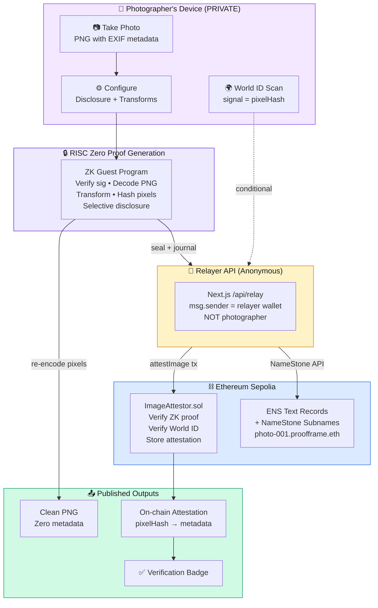

---

## 2. ZK Guest Program — Internal Data Flow

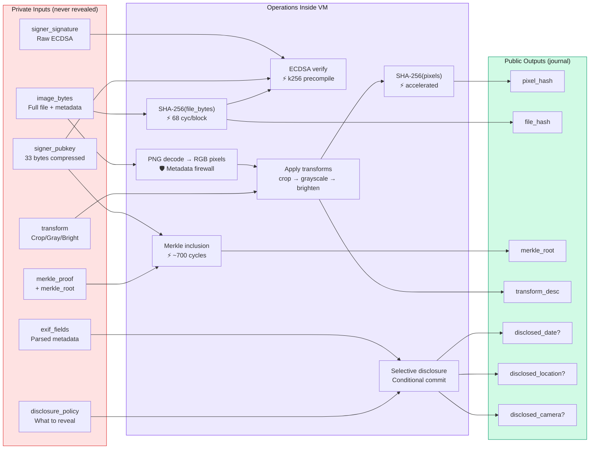

---

## 3. Privacy Model — Two Verification Paths

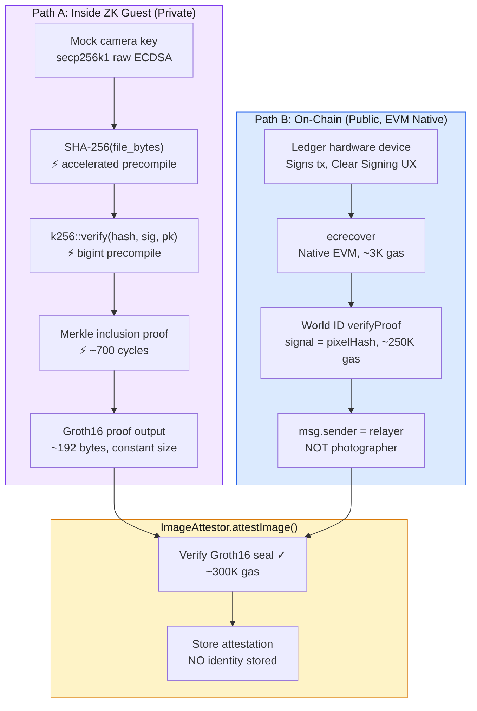

> **Key insight:** These paths NEVER cross. The ZK guest uses SHA-256 (accelerated).
> The EVM uses Keccak-256 (native). Each verification happens in its optimal environment.

---

## 4. Metadata Stripping — The Firewall

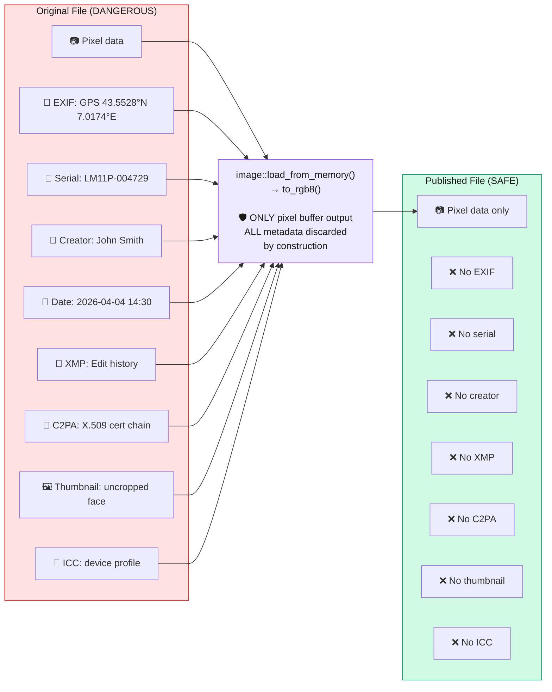

---

## 5. Selective Disclosure Scenarios

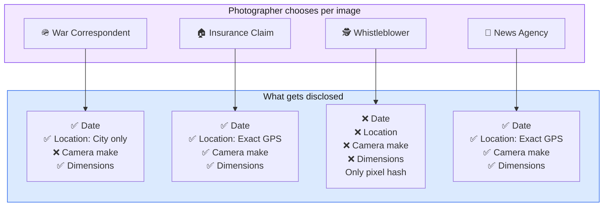

---

## 6. Trust Levels — Honest Assessment

```mermaid
graph LR
    subgraph L1["Level 1: Hackathon"]
        L1S["Mock software key<br/>signs file hash"]
        L1P["Proves: registered signer<br/>committed to this image"]
        L1T["Trust: REPUTATION<br/>Revoke key if signer attests fakes"]
    end

    subgraph L2["Level 2: Production"]
        L2S["Ledger hardware key<br/>in secure element"]
        L2P["Proves: hardware device<br/>approved this content"]
        L2T["Trust: KEY THEFT RESISTANCE<br/>Can't extract key remotely"]
    end

    subgraph L3["Level 3: Full C2PA"]
        L3S["Camera factory key<br/>Leica/Sony/Nikon"]
        L3P["Proves: authorized camera<br/>CAPTURED this image"]
        L3T["Trust: CAPTURE PROOF<br/>Photographer never touches key"]
    end

    L1 -->|"upgrade path"| L2
    L2 -->|"upgrade path"| L3

    style L1 fill:#fef3c7,stroke:#d97706,color:#1a1a1a
    style L2 fill:#dbeafe,stroke:#2563eb,color:#1a1a1a
    style L3 fill:#d1fae5,stroke:#059669,color:#1a1a1a
```

> **Same ZK pipeline at all 3 levels.** Only the signing key changes.
> ProofFrame's contribution is the privacy layer that works at every trust level.

---

## 7. Relayer Pattern — Why msg.sender is Irrelevant

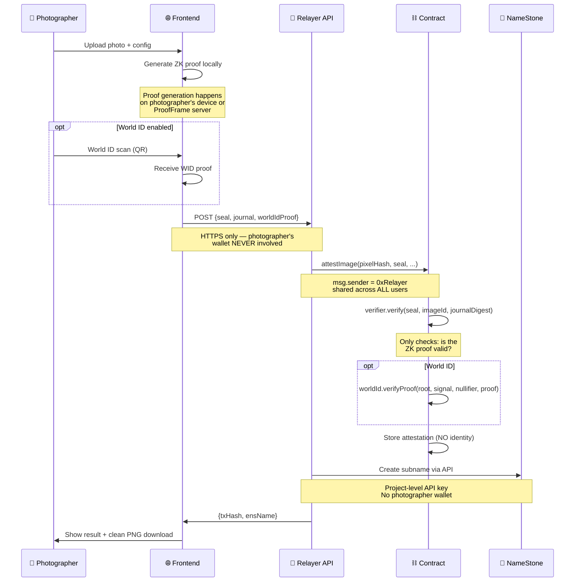

---

## 8. Sponsor Integration Map

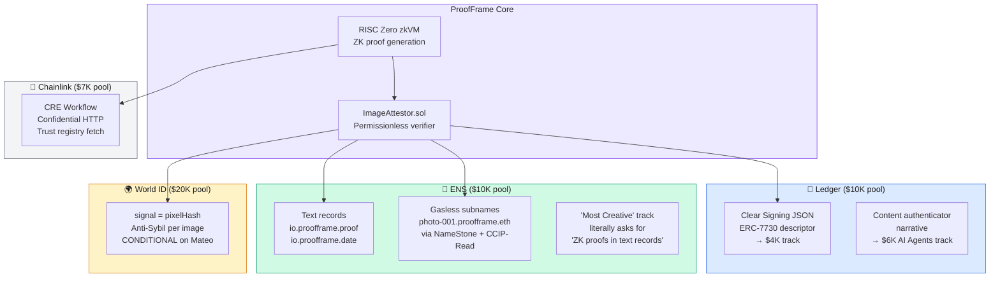

---

## 9. Verification Flow (Anyone Can Verify)

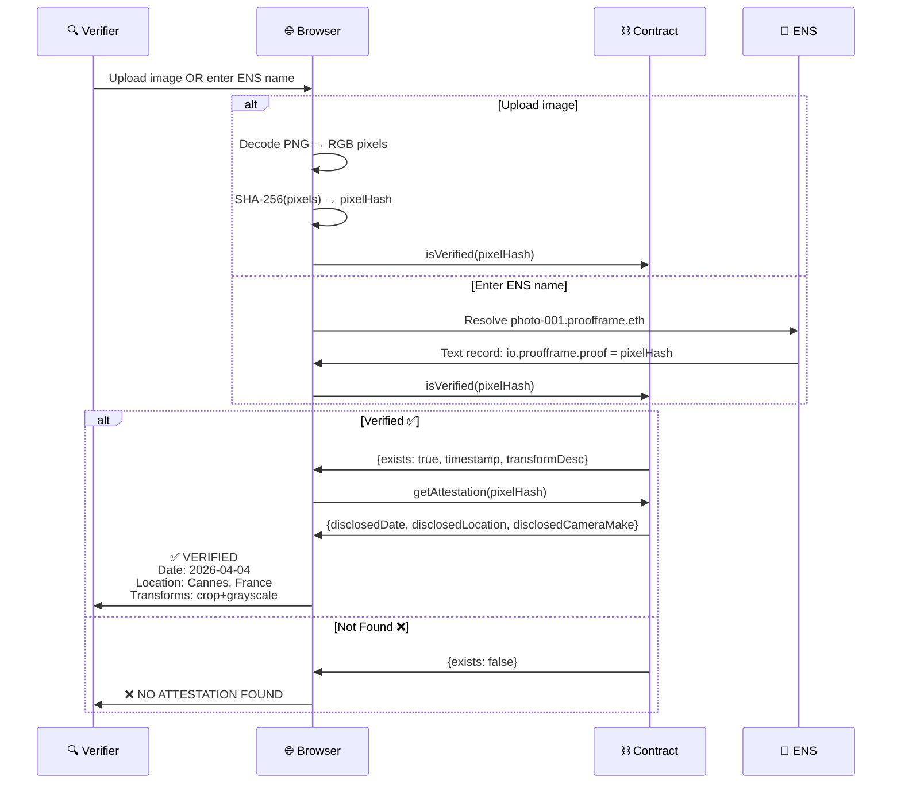

---

## 10. Performance Budget

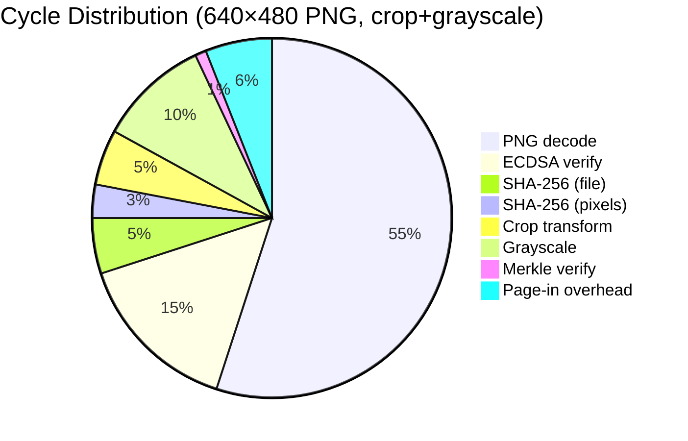

| Component | Cycles | Time (GPU) |
|-----------|--------|------------|
| Total (~30M cycles) | ~15-55M | ~30-90s on RTX 4090 |
| Dev mode | N/A | ~2s (fake proof) |
| On-chain verify | ~300K gas | ~$0.40 at 30 gwei |

---

## 11. Repository Structure

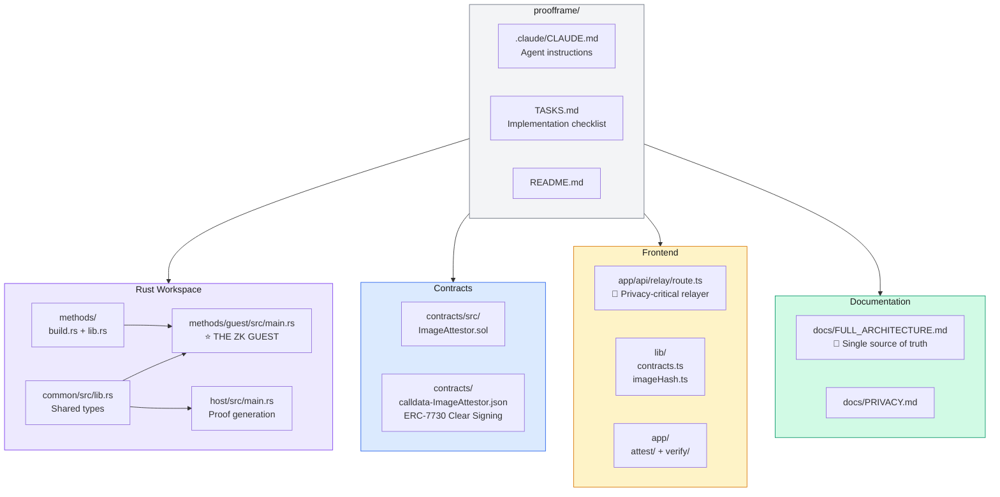

---

## 12. Build Timeline (36 Hours)

```mermaid
gantt
    title ProofFrame Hackathon Build Plan
    dateFormat HH:mm
    axisFormat %H:%M

    section Phase 1: ZK Core
    Setup + compilation test    :crit, p1a, 00:00, 2h
    Guest program              :crit, p1b, after p1a, 4h
    Host program + e2e test    :p1c, after p1b, 2h

    section Phase 2: Chain
    Deploy contracts           :p2a, after p1c, 2h
    World ID decision          :milestone, m1, after p1c, 0h
    Ledger + World ID          :p2b, after p2a, 4h

    section Phase 3: Frontend
    ENS integration            :p3a, after p2b, 2h
    Upload + verify UI         :p3b, after p3a, 4h

    section Phase 4: Polish
    Chainlink CRE              :p4a, after p3b, 2h
    Clear Signing JSON         :p4b, after p4a, 1h
    Pre-compute proofs         :crit, p4c, after p4b, 3h

    section Phase 5: Demo
    Sleep                      :done, sleep, after p4c, 4h
    Record demo video          :p5a, after sleep, 2h
    README + submit            :p5b, after p5a, 2h
    Sponsor booths             :crit, p5c, after p5b, 4h
```

---

## 13. Contingency Decision Tree

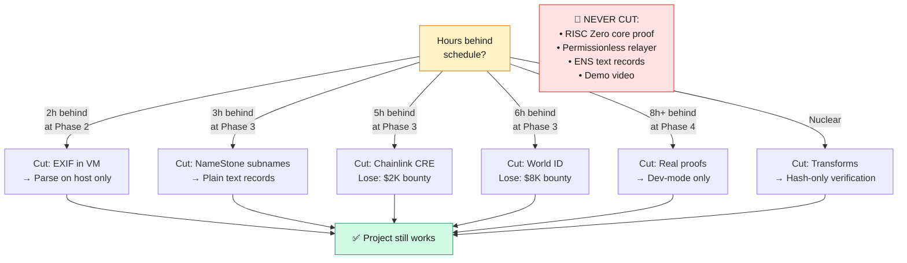
